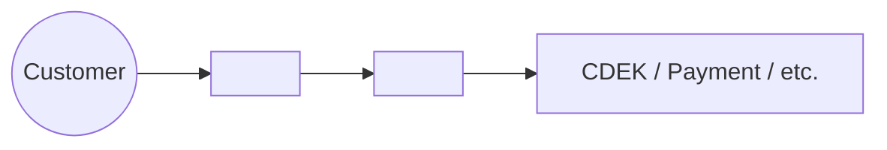
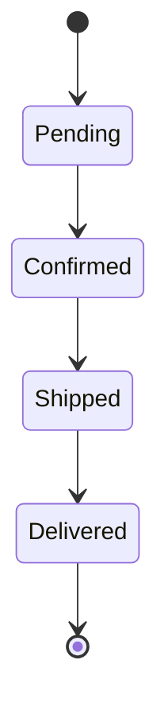

# Artifact Templates

This skill provides the **uniform Markdown structure** for every artifact produced in the Plane Conductor pipeline.

**When you load this skill:** find the section matching the artifact you are about to write, copy the template, fill it in. Don't invent structure — uniformity is the whole point.

**Storage rules** (defined in `plane-api.md` §2):

| Artifact | Where it lives in Plane |
|---|---|
| REQUIREMENTS | `description_html` of root issue (the business-analyst) |
| SPEC | `description_html` of SPEC sub-issue (the system-analyst) |
| ARCH_REVIEW | comment in SPEC sub-issue (the architect) |
| SPEC_APPROVED marker | comment in SPEC sub-issue (the architect, after iterations) |
| Design brief | `description_html` of Design sub-issue (the designer) |
| PLAN (backend / frontend) | `description_html` of role sub-issue (the django-developer / the vue-developer / the react-developer) |
| CHANGES (backend / frontend) | comment in role sub-issue (the django-developer / the vue-developer / the react-developer) |
| Test plan (API / UX) | `description_html` of test sub-issue (the api-tester / the ui-tester) |
| Bug report | comment in test sub-issue + link to relevant Code sub-issue |
| Test report | comment in test sub-issue (final summary by the api-tester / the ui-tester) |
| REVIEW | `description_html` of Review sub-issue (the reviewer) |

All artifacts written as **Markdown**, then converted to HTML for `description_html` / `comment_html`. Plane preserves headings, bold, lists, code blocks, tables, links.

---

## REQUIREMENTS (the business-analyst) — BABOK v3 4-type structure

the business-analyst fills this template across **4 interview phases**. See `babok-elicitation` skill for the technique behind each phase. Re-entry detection uses the "Phase status" section (last) — first unchecked phase = current phase.

```markdown
# {Title}

## 1. Business Requirements
*(Phase 1 — answers "why")*

Higher-level needs of the enterprise.
- {1–3 bullets / paragraphs of business outcome}

**Success metrics:**
- {observable indicators — what changes if this ships well}

## 2. Stakeholders
*(Phase 1)*

| Stakeholder | Role | Needs (high level) | Influence |
|---|---|---|---|
| {actor} | {what they do} | {what they want from this work} | high / medium / low |

## 3. Stakeholder Requirements
*(Phase 2 — needs per actor, not yet "what system does")*

### {Actor 1}
- {need expressed from their perspective}

### {Actor 2}
- ...

## 4. Solution Requirements
*(Phase 3 — Functional, Phase 4 — Non-functional)*

### Functional Requirements
- FR-1: {observable system behaviour}
- FR-2: ...

### Non-functional Requirements
- NFR-1: {performance / latency / throughput}
- NFR-2: {security / privacy / compliance}
- NFR-3: {scalability / availability}
- NFR-4: {usability / accessibility}

## 5. Transition Requirements
*(Phase 4 — temporary capabilities for moving from current to future state)*

- **Data migration**: {backfill / one-time migration / ETL}
- **Parallel run / coexistence**: {old & new endpoints both alive for N days}
- **Feature flag rollout**: {percentage rollout, kill-switch}
- **Training / documentation**: {operator runbooks, customer-facing help}
- **Deprecation**: {deprecation header, sunset date, migration guide}

## 6. Acceptance Criteria
*(Phase 3 — Given/When/Then format, Gherkin-style)*

```
Given <precondition>
When <action>
Then <observable result>
```

Each FR-N gets at least one acceptance criterion. Edge cases included.

## 7. Out of scope
*(any phase — capture explicit non-goals as they arise)*

- {item} — {reason / when it might come back}

## 8. Open questions
*(any phase — questions still pending answer)*

- {numbered list with the initiator/the architect target where relevant}

---

## Phase status

the business-analyst uses this to track which interview phase has been completed. Re-entry detection reads this list — first unchecked = current phase.

- [ ] Phase 1: Vision & Stakeholders → fills sections 1, 2
- [ ] Phase 2: Stakeholder Requirements → fills section 3
- [ ] Phase 3: Functional & Acceptance → fills section 4 (Functional) + section 6
- [ ] Phase 4: Non-Functional & Transition → fills section 4 (Non-functional) + section 5
- [ ] Phase 5: Final lock — all phases ✓, no open questions, ready for the system-analyst
```

---

## SPEC (the system-analyst) — phase-decomposed, with C4 / DDD / ADR / traceability

the system-analyst fills this template across **6 phases** (one per agent run). See `system-design-techniques` skill for the rationale of each section. Re-entry uses the Phase status section at the bottom.

```markdown
# SPEC: {Title}

## Assumptions
List anything the system-analyst assumes is true without explicit confirmation. Each assumption is a future test target — if wrong, SPEC needs revision.
- {assumption 1}
- {assumption 2}

## 1. Context & Domain
*(Phase 1)*

### Overview
1–2 paragraphs of what is being built. Anchored on REQUIREMENTS sections 1 (Business) and 3 (Stakeholder Requirements).

### System Context (C4 Level 1) — only if change affects system boundary


### Affected bounded contexts (DDD)
- `customers` — {what changes here}
- `users` — {what changes here, or N/A}
- `sellers`, `employees`, `common`, `shared` — {as relevant}

### Affected frontends
- `<storefront-app>` (Vue 3 / Nuxt 3): {pages, components}
- `<admin-panel>` (Vue 2 / Nuxt 2): {if any}
- `<pos-panel>` (Vue 2 / Nuxt 2): {if any}
- `<angular-admin-app>` (Angular): {if any}

## 2. Data Model
*(Phase 2)*

### {Service}.{ModelName}
- Field `{name}: {type}` — {description, null/blank, default, constraints}
- Indexes: {single / composite / partial}
- FK on_delete semantics: {CASCADE / PROTECT / SET_NULL — and why}
- Multi-tenancy: `company = ForeignKey('companies.Company', on_delete=PROTECT)` ✓ confirmed
- Migration: {description, backward-compatibility approach}

## 3. API Contract
*(Phase 3)*

### {METHOD} /api/v1/{path}/
**Purpose:** {what it does}

**Request:**
```json
{ "field": "..." }
```

**Response 201:**
```json
{ "id": "uuid", "..." }
```

**Errors:**
- `400 Bad Request` — {validation cases}
- `403 Forbidden` — {permission cases}
- `404 Not Found` — {missing resource cases}
- `409 Conflict` — {state-conflict cases, if any}

**Idempotency:** {Idempotency-Key header / N/A}
**Pagination:** {cursor / N/A}
**Filtering:** {?status=, ?ordering= / N/A}
**Versioning:** {/api/v1/ — and parallel-run plan if breaking}

## 4. Frontend Behaviour & Business Rules
*(Phase 4)*

### Frontend
- App: {<storefront-app> / <admin-panel> / <pos-panel> / <angular-admin-app>}
- Page / route: {path}
- New components: {ComponentName} — {responsibility}
- State management: {Pinia store / Vuex module}
- Data fetching: {useFetch / useAsyncData / $axios pattern}
- Loading / empty / error states: {what user sees}

### Business Rules
Non-trivial logic NOT obvious from API contract:
- BR-1: {rule statement}
- BR-2: ...

### State machine (if relevant)


## 5. Quality Attributes
*(Phase 5)*

### Security & Multitenancy
- Every new endpoint: queryset filtered by `company=request.user.company`
- Permission classes: {DRF permission names}
- PII handling: {sensitive fields, masking, logging policy}
- HMAC / signed tokens for integrations: {applicable / N/A}

### Performance
- Expected QPS: {peak / average}
- Caching strategy: {SegmentModelCache / Redis with TTL / N/A}
- Indexes (cross-ref §2): {what supports the hot queries}
- Async / Celery: {which tasks, retry strategy}

### Migration plan (if breaking change)
Multi-step deployment to maintain backward compatibility:
1. Add new field/endpoint, nullable / default / parallel-running
2. Backfill / dual-write
3. Migrate clients
4. Remove old field/endpoint

## 6. Open questions & Architectural Decisions
*(Phase 6)*

### Architectural Decision Records (ADR)
Use this for any non-obvious architectural choice. Status: Proposed → Accepted (the architect approves) / Superseded.

#### ADR-1: {short title}
**Status:** Proposed
**Context:** {forces in play}
**Decision:** {chosen option}
**Consequences:** {positive / negative / neutral}
**Alternatives considered:** {with rejection reasons}

### Open questions
- Numbered. Each addresses the initiator or the architect explicitly.

## 7. Traceability
*(Phase 6 — final lock)*

| Requirement | Addressed in SPEC section |
|---|---|
| FR-1 from REQUIREMENTS | §2 (model field), §3 (endpoint), §4 (UI component) |
| FR-2 | §3 ({METHOD} /api/.../) |
| NFR-1 latency | §5 Performance (composite index, caching) |
| NFR-2 multi-tenancy | §5 Security (queryset filter) |
| NFR-3 transition: data backfill | §5 Migration plan |

Every FR/NFR from REQUIREMENTS must have a row. Every SPEC §-section must trace back to a REQUIREMENTS item or be flagged as "the system-analyst's assumption" (move to Assumptions section).

---

## Phase status

the system-analyst uses this for re-entry detection — first unchecked phase = current phase.

- [ ] Phase 1: Context & Domain → fills sections 1
- [ ] Phase 2: Data Model → fills section 2
- [ ] Phase 3: API Contract → fills section 3
- [ ] Phase 4: Frontend & Business Rules → fills section 4
- [ ] Phase 5: Quality Attributes → fills section 5
- [ ] Phase 6: Final lock — ADRs + Open questions resolved + Traceability matrix complete; ready for the architect ARCH_REVIEW
```

---

## ARCH_REVIEW (the architect — comment on SPEC sub-issue)

Each iteration of review = **new comment** (don't edit previous; preserve history).
Verdict logic:
- Any **blocker** finding → CHANGES_REQUIRED
- 0 blockers + any **major** → CHANGES_REQUIRED (the architect's discretion if minor enough)
- 0 blockers + 0 majors → APPROVED

```markdown
# ARCH_REVIEW iteration {N}

**Verdict: {APPROVED | CHANGES_REQUIRED | BLOCKED}**

## 6-Area coverage
| Area | Status | Note |
|---|---|---|
| Service boundaries (DDD, importlinter) | ✓ / ⚠ / ✗ | ... |
| Multitenancy (company filter, queryset scope) | ✓ / ⚠ / ✗ | ... |
| Performance (N+1, indexes, caching, async) | ✓ / ⚠ / ✗ | ... |
| Transactions & concurrency (atomic, idempotency, race) | ✓ / ⚠ / ✗ | ... |
| Integration security (HMAC, secrets, rate limit) | ✓ / ⚠ / ✗ | ... |
| Migrations & Transition (backward compat, multi-step, flags) | ✓ / ⚠ / ✗ | ... |

## ADR validation
| ADR | the system-analyst's status | My action | Note |
|---|---|---|---|
| ADR-1 {title} | Proposed | Accept / Modify / Reject | ... |
| ADR-2 {title} | Proposed | Accept / Modify / Reject | ... |

For Modify / Reject — give the new wording or counter-decision.
If SPEC has architectural choices NOT captured as ADR but should be → list them with severity major.

## Traceability check
- Every FR / NFR from REQUIREMENTS has SPEC entry: ✓ / ✗ (list gaps)
- Every Transition Requirement maps to §5 Migration plan: ✓ / ✗
- Every SPEC item traces to FR/NFR or to "Assumptions": ✓ / ✗ (list invented scope)

## Findings
### {finding-id}: {short title}
- Severity: blocker / major / minor
- Where: {SPEC §-section, ADR-N, or Traceability row}
- Issue: {what's wrong}
- Suggested fix: {what to change}

## What is good
Briefly note what's done right — so the system-analyst keeps it on iteration N+1.

## Status next
- APPROVED → in next comment, post `SPEC_APPROVED` marker (template below). Coders unblocked.
- CHANGES_REQUIRED → the system-analyst addresses findings, updates SPEC, the architect re-reviews as iteration {N+1}.
- BLOCKED → upstream input missing (e.g. REQUIREMENTS too vague). Mention the initiator, escalate.
```

---

## SPEC_APPROVED marker (the architect — final comment after APPROVED ARCH_REVIEW)

Single short comment after the final approving ARCH_REVIEW. Marks "ready for coders to start".

```markdown
**SPEC_APPROVED**

Ready for implementation. Coders can pick up.

- Backend scope: {2-line summary}
- Frontend scope: {2-line summary}
- Design dependency: {required / not required}

<mention initiator>
```

---

## Design brief (the designer) — UX flow + Figma frame inventory

The brief lives in the Design sub-issue's `description_html`. Iterations via comments. the designer re-uses this template in Mode B (UX review) post-implementation as a checklist.

```markdown
# Design: {Title}

## Figma
Primary link with anchor: {https://www.figma.com/file/.../frame?node-id=123-456}

Additional frames (referenced in screen/state matrix below):
- Empty state: {anchor}
- Error state: {anchor}
- Mobile variant: {anchor}

## UX flow
Step-by-step user journey from entry to exit. **Behaviour, not pixels.**
1. User lands on {screen} from {previous context}.
2. Sees {primary content / CTA}.
3. Selects {option / interaction}.
4. Sees {next state with feedback}.
5. ...

## Screen / state matrix

For every screen, declare which states are designed. 8-state minimum (see `ux-design-discipline` skill).

| Screen | Empty | Loading | Partial | Success | Error | Permission denied | Edge | Disabled |
|---|---|---|---|---|---|---|---|---|
| /account/orders | ✓ | ✓ | ✓ | ✓ | ✓ | ✓ | ✓ | N/A |
| /account/orders/{id} | N/A | ✓ | N/A | ✓ | ✓ | ✓ | ✓ | ✓ (locked status) |

Each ✓ has a Figma frame; N/A has reason.

## Components introduced

For each new component:
- **Name:** ComponentName
- **Purpose:** one line
- **Variants:** primary / secondary / ghost / disabled
- **Props (if known):** {prop names + intended types — coder owns final API}
- **Accessibility:** focus order, keyboard interactions, ARIA roles
- **States:** which of the 8 states the component supports

## Heuristics check (Nielsen 10)

Brief notes on which heuristics drove the design decisions:
- Visibility of system status: {how / where applied}
- Match real world: {label choices, mental model}
- User control: {undo / cancel paths}
- ... (only for heuristics with non-obvious application)

## Brand / system tokens

- Colors: use semantic tokens from design system ({primary}, {error}, {surface-1}, etc. — not hex literals)
- Typography: use tokens ({heading-md}, {body-sm}, ...)
- Spacing: use 4 / 8 / 16 / 24 / 32 scale; no arbitrary values
- Motion: max 200ms transitions; respect `prefers-reduced-motion`

## Accessibility callouts (in addition to default WCAG 2.1 AA)

- Specific focus traps for modal dialogs
- Keyboard shortcuts: {if any}
- Screen reader announcements: {for live updates, e.g. order status changes}

## Constraints / out of scope

- Out of scope: {features deferred to future iteration with reason}
- Constraint: {e.g. must work without JS, or must support back-button history}

## Open questions

Numbered. Resolved with the initiator / the system-analyst / the architect in comments before Frontend coder picks up.

1. Should empty state show CTA to create new order or link to /catalog?
2. ...

## UX review log (Mode B — appended in comments after Frontend ships)

When the designer re-runs in UX review mode, findings go in **separate comments** (not edited into description). Each finding cites a Nielsen heuristic and / or WCAG criterion.
```

---

## PLAN (the django-developer — backend description, before code)

See `python-developer.md` (the django-developer prompt) for full template. Short version:

```markdown
# Backend PLAN: {Title}

## Files to change
- `{path}` — {what changes}

## Migrations
- `{app}`: {description}, backward-compatible / breaking + multi-step plan

## Tests to add
- `{test_path}::{test_name}` — {what it covers}

## Risks / open questions
- Numbered.

## Out of scope (per SPEC)
- Items deferred to other roles or future work.
```

Frontend version (the vue-developer / the react-developer) is the same shape with frontend-relevant categories: components, routes, state modules.

---

## CHANGES (the django-developer / the vue-developer / the react-developer — comment after implementation)

```markdown
# {Backend|Frontend} CHANGES: {Title}

## Files modified
### {path}
- {bullet list of edits}

## Migrations
- `{app}/migrations/{name}.py` — {description}

## Verification
- ✅ {linter command} — 0 errors
- ✅ {test command} — N passed, 0 failed
- ✅ {build / type-check command} — clean

## Performance (if perf task)
| Metric | Before | After | Δ |
|---|---|---|---|
| {cmd} | {value} | {value} | {%} |

## Deviations from PLAN
- {if any} — what changed and why.

## Not implemented (deferred)
- {if any} — what was deferred and why.
```

---

## Test plan (the api-tester / the ui-tester — sub-issue description) — ISTQB-structured

Each TC declares its **technique** (Equivalence Partitioning / BVA / Decision Table / State Transition / Use Case / Error Guessing). Coverage matrix at the end traces TC → FR/NFR/Acceptance Criterion from REQUIREMENTS.

Description is **immutable after Phase 1 lock** — once test plan is posted, results live in comments. Plan revisions = new iteration if SPEC / REQUIREMENTS change.

```markdown
# {API | UX} Test plan: {Title}

## Scope
- In scope: {features / endpoints / pages}
- Out of scope: {explicit non-goals}

## Test approach
- Test level: System (REST API for the api-tester / E2E UI for the ui-tester)
- Test types: Functional + {non-functional types relevant: performance, accessibility, security}
- Tools: {curl / pytest+requests / Postman / Playwright / manual browser / axe-core for a11y}
- Environment: {local / staging / production-like}

## Test cases

### TC-1: {short name}
- **Technique:** Equivalence Partitioning / BVA / Decision Table / State Transition / Use Case / Error Guessing
- **Validates:** FR-N (or NFR-N or Acceptance Criterion AC-N from REQUIREMENTS)
- **Preconditions:** {setup state, fixture data, auth context}
- **Steps:**
  1. {action}
  2. {action}
- **Expected:** {observable result, with concrete values}
- **Notes:** {boundary value chosen / equivalence class represented}

### TC-2: ...

## Coverage matrix

| FR / NFR / AC | TC IDs |
|---|---|
| FR-1 | TC-1, TC-2, TC-5 (boundary) |
| FR-2 | TC-3 |
| NFR-1 latency | TC-P1 |
| NFR-2 a11y | TC-A1 (the ui-tester only) |

Every FR / NFR / Acceptance Criterion has at least one TC. Gaps = test plan incomplete.
```

---

## Bug report (the api-tester / the ui-tester — comment in test sub-issue) — ISTQB defect template

Severity (technical impact) is set by tester. Priority (business urgency) is the initiator's decision — leave as TBD.

```markdown
# Bug: {Short title — bug name + affected component}

**Severity:** blocker / major / minor / cosmetic
**Priority:** TBD by the initiator
**Reproducible:** always / intermittent / once-only

## Failing test case
TC-{N} from test plan (for traceability). Cite the technique (e.g. "BVA — boundary value 0").

## Steps to reproduce
1. ...
2. ...
3. ...

## Actual result
{what happens, with exact error messages / status codes / observed UI}

## Expected result
Per FR-{N} / Acceptance Criterion AC-{N}: {what should happen}

## Environment
- Backend: <backend-app> commit {SHA}, Python 3.11, Postgres 16
- Frontend (the ui-tester only): {browser + version, viewport, OS}
- Test data state: {fixtures / specific setup}
- Plane: <PROJECT_IDENTIFIER>-{N} (root issue)

## Affected sub-issue
{Backend — <PROJECT_IDENTIFIER>-N | Frontend — <PROJECT_IDENTIFIER>-N} — link to the sub-issue whose work introduced this.

## Suggested area to investigate (optional)
{If tester has insight from logs / error message — point coder at likely file/function. Don't prescribe fix.}

## Attachments (UX bugs only)
- {Screenshot URLs from S3, attached via Operation §6.10 `attach_screenshot`}
- {Optional: screen recording link}

<mention initiator>
```

### Severity legend (ISTQB-aligned)
- **blocker** — release-stopping, data loss / corruption, security breach, core flow broken
- **major** — significant function broken, common scenario fails, no acceptable workaround
- **minor** — limited function broken, edge case fails, workaround exists
- **cosmetic** — visual / typo / non-functional polish

---

## Test report (the api-tester / the ui-tester — final comment after testing complete)

Posted after all test cases executed (or blocked). One per testing iteration; new iteration after coders ship a fix.

```markdown
# Test report — iteration {N}

## Summary
- Total TCs: N
- Passed: N (✅)
- Failed: N (❌ — see bug comments above)
- Blocked: N (⚠️ preconditions not met / infrastructure issue)

## Coverage matrix verification (vs test plan)
| FR / NFR / AC | TCs | Status |
|---|---|---|
| FR-1 | TC-1, TC-2 | ✅ passed |
| FR-2 | TC-3 | ❌ failed (Bug #1 above) |
| NFR-1 latency | TC-P1 | ✅ passed (p95 230ms < 300ms target) |
| NFR-2 a11y | TC-A1 | ⚠️ blocked (axe-core not configured) |

## Bug summary
- {bug-id-1}: {title} — severity {S}
- {bug-id-2}: {title} — severity {S}

## Regression status (iteration > 1 only)
For previously-failed TCs that were re-executed after a fix:
- TC-3 (Bug #1 fixed in {sub-issue}): ✅ now passing
- TC-7 (Bug #2 fixed): ❌ still failing — re-opened as Bug #5

## Verdict
- READY FOR REVIEW: yes / no
- If no — what blocks: {list of blocker / major bugs}
- Recommended next: {which agent / role the initiator should trigger}

<mention initiator>
```

---

## REVIEW (the reviewer — sub-issue description)

End-to-end coherence + security + quality review. the reviewer reads everything, validates traceability across artifacts, applies OWASP Top 10 + SOLID lens, classifies findings.

```markdown
# REVIEW: {Title} — iteration {N}

**Verdict: {APPROVED | CHANGES_REQUIRED | BLOCKED}**

## Reviewed artifacts
- REQUIREMENTS: root description (the business-analyst) — {short note on completeness}
- SPEC: {link to <PROJECT_IDENTIFIER>-{seq}} (the system-analyst, the architect APPROVED)
- Design: {link} (the designer) — Mode B UX review {APPROVED / N/A}
- Backend CHANGES: {link} (the django-developer)
- Frontend CHANGES: {link} (the vue-developer / the react-developer)
- API test report: {link} (the api-tester) — {N passed / F failed}
- UX test report: {link} (the ui-tester) — {N passed / F failed}

## End-to-end traceability check

Walk every FR / NFR / Acceptance Criterion from REQUIREMENTS through the chain:

| FR / NFR / AC | SPEC § | Backend CHANGES | Frontend CHANGES | the api-tester TC | the ui-tester TC | Status |
|---|---|---|---|---|---|---|
| FR-1 | §3 endpoint, §4 component | ✓ | ✓ | TC-1 ✓ | TC-3 ✓ | ✅ end-to-end |
| FR-2 | §5 migration | ✓ | N/A | TC-P1 ✓ | N/A | ✅ |
| NFR-1 latency | §5 indexes | ✓ | N/A | TC-P1 (p95 230ms) | N/A | ✅ |
| FR-3 | §3 | ✓ | NOT IMPLEMENTED | NOT TESTED | NOT TESTED | ❌ blocker |

## OWASP Top 10 quick-pass

| Category | Status | Note |
|---|---|---|
| A01 Access Control / multitenancy | ✓ / ⚠ / ✗ | ... |
| A02 Cryptographic Failures | ✓ / ⚠ / ✗ | ... |
| A03 Injection | ✓ / ⚠ / ✗ | ... |
| A04 Insecure Design | ✓ / ⚠ / ✗ | ... |
| A05 Misconfiguration | ✓ / ⚠ / ✗ | ... |
| A07 Auth Failures | ✓ / ⚠ / ✗ | ... |
| A08 Integrity (HMAC, etc.) | ✓ / ⚠ / ✗ | ... |
| A09 Logging | ✓ / ⚠ / ✗ | ... |
| A10 SSRF | ✓ / ⚠ / ✗ | ... |

(A06 Vulnerable Components — pinned via dependency hygiene; spot-check only.)

## Code quality (SOLID + Google practices)
- {File / class}: {issue + principle violated + suggested fix}

## Documentation
- Docstrings present where required: ✓ / ⚠ (list gaps)
- README / docs updated for user-facing changes: ✓ / ⚠
- Migration files have intent docstring: ✓ / ⚠
- ADR statuses updated (Implemented / Superseded): ✓ / ⚠

## Findings
### {finding-id}: {title}
- Severity: blocker / major / minor
- Category: traceability / security / quality / docs
- Where: {sub-issue link | file:line | matrix row}
- Issue: {what's wrong}
- Suggested fix: {action — including which agent should pick it up: the django-developer / the vue-developer / the system-analyst / the designer}

## Cross-cutting concerns
- Implementation matches APPROVED SPEC? {yes / drift listed}
- Testing covered the full SPEC? {yes / gaps listed → recommend the api-tester / the ui-tester regression}
- the designer UX review APPROVED for frontend? {yes / outstanding issues}

## Verdict & next steps

**Verdict: {APPROVED | CHANGES_REQUIRED | BLOCKED}**

If APPROVED: pipeline is ready for commit + deploy + closure by the initiator.
If CHANGES_REQUIRED: list which agents the initiator should re-trigger:
- the django-developer — for {issue}
- the ui-tester — for regression on {TC}
- the designer — for UX rework on {component}

<mention initiator>
```

---

## Common rules across all artifacts

### Markdown only
Plane converts to HTML on save. Stick to standard Markdown. No Slack/Discord syntax.

### Short titles
First-line `#` heading should fit in a Plane sub-issue listing (~80 chars).

### Mention syntax
For the initiator: full HTML mention-component (see `plane-operations` skill, "Mention syntax" section).
For other agents: don't mention. the initiator triggers them.

### Don't dump irrelevant context
Each artifact has one purpose. Don't paste REQUIREMENTS into SPEC. Refer by sub-issue identifier (`<PROJECT_IDENTIFIER>-N`).

### Date / version stamps — not needed
Plane records timestamps automatically on every comment and edit. Don't add `Date: 2026-04-30` headers.

### Code blocks with language tag
Always: ` ```python `, ` ```bash `, ` ```sql `. Plane syntax-highlights based on the tag.
