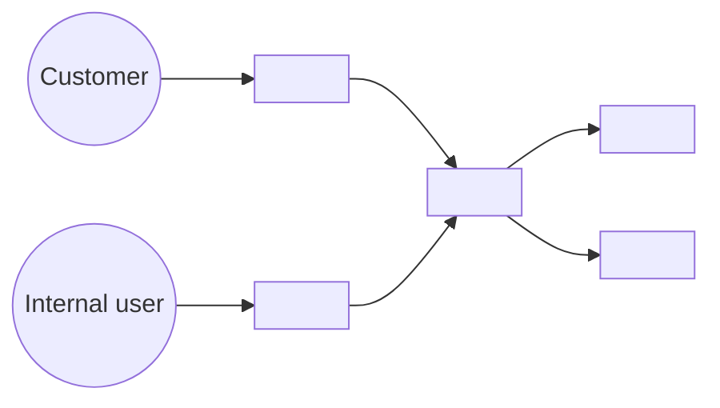
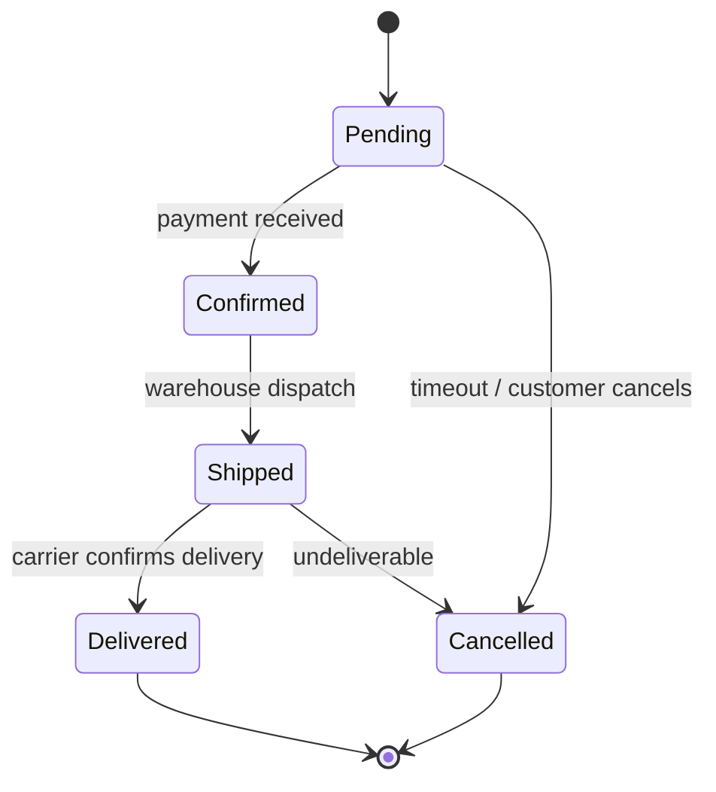

# System Design Techniques — SA reference

This skill encodes industry-standard system analysis techniques used by the system-analyst. Inspired by:
- **C4 Model** (Simon Brown) — architecture diagrams at multiple zoom levels
- **DDD** (Eric Evans, Vaughn Vernon) — bounded contexts, ubiquitous language
- **REST design** (Roy Fielding, Mark Massé "REST API Design Rulebook")
- **IEEE 29148:2018** — Systems and software engineering — Requirements engineering
- **ADR** (Michael Nygard) — Architecture Decision Records

We use a **focused subset** — enough discipline to make SPEC professional and traceable, without ceremony overhead.

---

## C4 Model — for the "Affected services" / "Architecture" sections

C4 has four zoom levels. The system-analyst uses **two**:

### Level 1: System Context
Who interacts with the system from outside? Single box for our system, surrounded by external actors and external systems.

The project's `$KB_DIR/kb/architecture.md` lists the external actors and integrations — use it as the source.

Use Mermaid to draw it (Plane renders Mermaid in markdown):


In SPEC: include this only when the change affects the system boundary (new external integration, new actor type). Otherwise skip.

### Level 2: Container view
Inside the system — what runs separately. Backend services + workers + cache + database + frontends.

Use only when change spans multiple containers (e.g. new background task that interacts with API + cache).

### Levels 3 (Component) and 4 (Code)
Skip in SPEC. Component-level structure is for code review (architect's ARCH_REVIEW or coder's PLAN). Don't pre-implement in SPEC.

---

## DDD — Bounded Contexts mapped to project services

Domain-Driven Design's most useful concept is **bounded context**: a logical boundary inside which a domain model is consistent. **Each project service / app is a bounded context.**

The project's `$KB_DIR/kb/architecture.md` declares the bounded contexts. Read it to get the canonical list before writing SPEC §1. Example shape (rename to your project's services):

| Bounded context (service / app) | Domain | Owns |
|---|---|---|
| `<users-service>` | identity, accounts | User, Account, permissions |
| `<customers-service>` | customer-facing flows | Customer, Order, Cart |
| `<sellers-service>` | merchant operations | Seller, catalogue (seller-side) |
| `<employees-service>` | internal staff console | Employee, internal roles |
| `<common-service>` | cross-cutting domain | callbacks, async webhooks |
| `<shared-lib>` | shared libs | utility models, no domain |

**Rules from DDD that the project's import contracts (`$KB_DIR/kb/architecture.md`) typically enforce:**
- ❌ A service cannot import another service's `filters`, `permissions`, `serializers`, `views` — these are part of the bounded context's "language".
- ✅ A service can import another service's **models** if the relationship is unavoidable (e.g. `customers/orders` references `users.accounts.Account`).
- ✅ All services can use `<shared-lib>` (genuinely cross-cutting).

**Ubiquitous language**: when SPEC introduces a new entity/concept, define it once and use the same term across all sections (and across REQUIREMENTS → SPEC → CHANGES → tests). Don't switch between synonyms ("tracking number" / "track ID" / "delivery code") — pick one term and stick with it.

**Anti-corruption layer**: when integrating with an external system, don't leak its terminology into the domain model. Wrap external concepts in our terms.

---

## REST API design — conventions for the "API contract" section

### Resource naming
- Plural nouns: `/api/v1/orders/`, `/api/v1/products/`. Not `/getOrder` or `/orderList`.
- Hierarchy via path: `/api/v1/orders/{id}/items/{item_id}/`.
- IDs are UUIDs unless stated otherwise.

### HTTP methods (idempotency matters)

| Method | Idempotent? | Use for |
|---|---|---|
| GET | yes | retrieval, no side effects |
| POST | no | create new resource (server assigns ID) |
| PUT | yes | replace whole resource at known URL |
| PATCH | no (technically) | partial update; treat as not idempotent unless explicit |
| DELETE | yes | remove resource |

For state changes that aren't simple CRUD: use a sub-resource or a verb-noun: `POST /api/v1/orders/{id}/cancel/`, `POST /api/v1/orders/{id}/ship/`. Don't put verbs in the resource itself.

### Status codes — pick the right one
- `200 OK` — successful read/update with body
- `201 Created` — successful POST creating resource (include `Location` header)
- `204 No Content` — successful DELETE or update without body
- `400 Bad Request` — validation error (give field-level details in body)
- `401 Unauthorized` — no/invalid auth
- `403 Forbidden` — auth OK but not allowed
- `404 Not Found` — resource doesn't exist (or hidden from this user — privacy)
- `409 Conflict` — state conflict (already cancelled, version mismatch)
- `422 Unprocessable Entity` — semantically wrong (rare; prefer 400)
- `429 Too Many Requests` — rate limited
- `5xx` — server-side errors

In SPEC: list **all** error codes the endpoint can return, not just the success path.

### Pagination
For list endpoints: cursor-based (`?cursor=...&page_size=...`) is preferred over offset-based for large datasets. Document the page size limit.

### Filtering and sorting
- Filter via query params: `?status=shipped&created_after=2026-01-01`.
- Sort via `?ordering=created_at` or `?ordering=-created_at`.

### Versioning
Path versioning: `/api/v1/...`. New breaking changes go to `/api/v2/`. Both run in parallel during migration (Transition Requirements).

### Idempotency keys (POST that creates payments / orders)
For non-idempotent POSTs that must be safe to retry: accept `Idempotency-Key` header. SPEC must mention this for any payment- or money-affecting endpoint.

---

## IEEE 29148 terminology — used in REQUIREMENTS / SPEC

Short, useful subset:
- **Stakeholder**: person/role/system with an interest in the work
- **Requirement**: a capability the system must have
- **Constraint**: a restriction on the design (must use Postgres, must be hosted in EU, etc.)
- **Assumption**: a belief held to be true without evidence — must be flagged so it's testable later
- **Verifiable**: a requirement is well-formed only if it can be tested objectively

When SPEC has assumptions — list them in "Open questions" or "Assumptions" so they don't become hidden constraints.

---

## ADR — Architecture Decision Record

When SPEC includes a **non-obvious architectural choice** (async vs sync? cache layer? new service vs extending existing one?), don't bury it in prose. Capture as ADR.

ADR format (one per decision, embedded in SPEC or as a separate sub-section):

```markdown
### ADR-{N}: {short title}

**Status:** Proposed (system-analyst) / Accepted (architect approved) / Superseded by ADR-{M}

**Context:**
What's the situation? What forces are at play?

**Decision:**
What's the decision? Pick one option clearly.

**Consequences:**
- Positive: ...
- Negative: ...
- Neutral: ...

**Alternatives considered:**
- {Alternative 1} — rejected because {reason}
- {Alternative 2} — rejected because {reason}
```

Use ADRs sparingly — only for decisions a future engineer would reasonably ask "why did we pick this?" about. Trivial choices don't need ADRs.

---

## Data modelling — minimal discipline

When SPEC proposes a new model or field:

### Normalisation
- Default to 3NF. Denormalise consciously, with reason (caching computed totals, denormalising for query speed).
- M2M is OK; through-models when M2M needs metadata (date_joined, role, etc.).

### Foreign keys
- Always specify `on_delete` semantics: CASCADE (child dies with parent) / PROTECT (block deletion) / SET_NULL (orphan child) / SET_DEFAULT.
- For multi-tenant data: PROTECT on the tenant FK (never accidentally cascade-delete tenants).

### Indexes
- Single-column: index columns used in WHERE / ORDER BY at query volume.
- Composite: for multi-column filters (e.g. `(<tenant_key>, status, created_at)` for "this tenant's recent records by status").
- Partial index for sparse filters (e.g. `WHERE status = 'pending'` if pending is a small fraction).
- For text search: `GinIndex` (Postgres full-text or trigram).

### Multi-tenancy
If `$KB_DIR/kb/multitenancy.md` declares the project is multi-tenant: **every new model gets the tenant FK** (e.g. `<tenant_key> = ForeignKey('<tenant-app>.<TenantModel>', on_delete=PROTECT)`). Querysets filter by the tenant key. Mention it explicitly in SPEC's Data Model section to confirm.

If `multitenancy.md` says "N/A" — skip this rule.

---

## Sequence and state diagrams (Mermaid)

For non-trivial flows (multi-step state machines, async pipelines), include a Mermaid sequence or state diagram in SPEC.

Example state diagram:


Don't draw a diagram for everything — only when prose alone makes the flow ambiguous.

---

## Traceability — every SPEC item must map back to REQUIREMENTS

End every SPEC with a **traceability matrix**: which FR / NFR from REQUIREMENTS each SPEC section addresses.

```markdown
## Traceability

| Requirement | Addressed in SPEC section |
|---|---|
| FR-1: customer sees tracking number | §3 Data Model (Order.tracking_number), §4 API Contract (GET /api/v1/orders/{id}/), §5 Frontend (account/orders/[id]) |
| FR-2: clicking tracking opens carrier page | §5 Frontend (carrier link helper) |
| NFR-1: latency p95 < 300ms with 50k records | §7 Performance (composite index on `(<tenant_key>, status, created_at)`) |
| NFR-2: only the resource's owner can view | §6 Security (queryset filter on owner) |
```

If a FR has no SPEC entry → either gap (mark "Open question") or out of scope (move to "Out of scope" with reason).
If a SPEC item doesn't map to any FR → either you invented scope (back to business-analyst) or it's a hidden assumption (lift to "Assumptions" section).

This matrix is enforced in SPEC's DoD and re-checked by the architect during ARCH_REVIEW.

---

## When in doubt

- Read your project's `plane-api.md` for protocol (referenced from `$KB_DIR/AGENTS.md`).
- Read `artifact-templates` skill for the canonical SPEC structure.
- For coding patterns the system-analyst proposes (model patterns, Celery patterns) — `django-models` and `celery-patterns` skills are also useful as cross-reference.
- Don't pre-implement (SPEC describes contracts, not code).
- Don't make architectural decisions that contradict the project's import contracts — escalate to the architect via comment.
